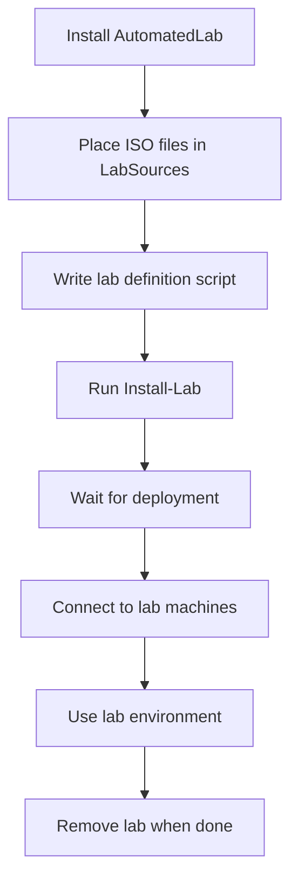
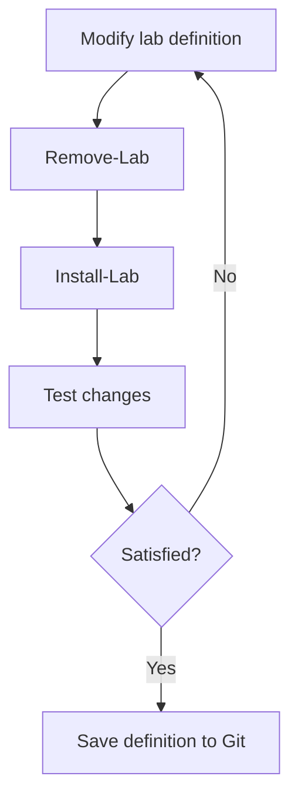
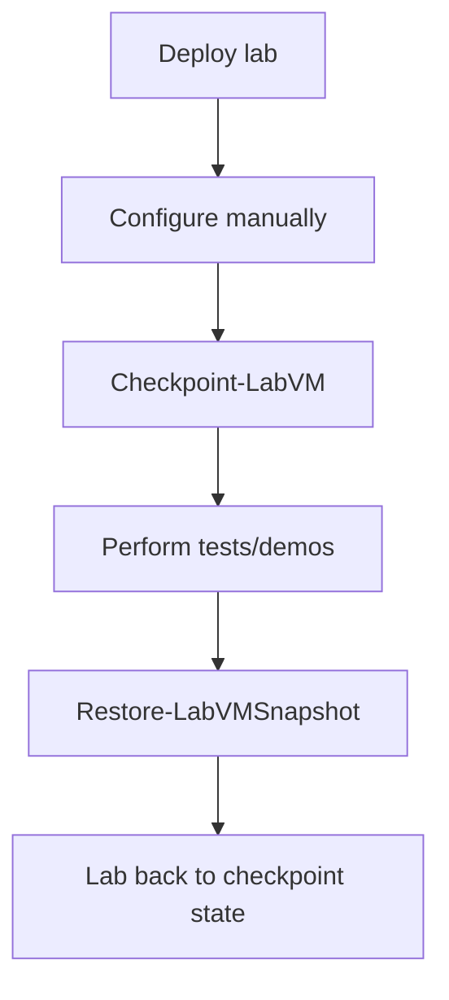

# Product Context: AutomatedLab

## Why AutomatedLab Exists

AutomatedLab was created to solve a fundamental problem in IT infrastructure: **setting up complex test and training environments is time-consuming, error-prone, and difficult to reproduce**.

### The Problem Space

**Before AutomatedLab:**
- Manual VM creation and configuration takes hours or days
- Setting up multi-machine scenarios (domains, clusters, etc.) requires extensive expertise
- Reproducing environments for testing or training is inconsistent
- Resource waste from maintaining permanent test infrastructure
- High barrier to entry for learning enterprise technologies

**Pain Points Addressed:**
1. **Time Investment**: Deploying a domain controller, SQL server, and development machine manually takes 4-8 hours
2. **Consistency Issues**: Manual setups vary between deployments
3. **Knowledge Requirements**: Deep expertise needed for complex configurations
4. **Resource Costs**: Permanent infrastructure for temporary testing needs
5. **Training Barriers**: Students/testers need environments quickly

## How AutomatedLab Works

### Core Concept: Infrastructure as Code

AutomatedLab treats lab environments as code, enabling:
- **Declarative Syntax**: Describe what you want, not how to build it
- **Version Control**: Lab definitions can be stored in Git
- **Sharing**: Teams can share lab configurations as scripts
- **Automation**: Integrate lab creation into CI/CD pipelines

### User Experience Goals

#### Simplicity for Simple Tasks
A single Windows 10 client requires only 3 lines:
```powershell
New-LabDefinition -Name Win10 -DefaultVirtualizationEngine HyperV
Add-LabMachineDefinition -Name Client1 -Memory 1GB -OperatingSystem 'Windows 10 Pro'
Install-Lab
```

#### Power for Complex Scenarios
Complex multi-domain forests with trusts, SQL clusters, Exchange, and TFS can be defined in ~100 lines of code.

#### Intelligent Defaults
- Automatic network configuration (IP ranges, virtual switches)
- Optimal disk placement based on performance measurement
- Smart parallelization of VM deployments
- Automatic DNS and domain configuration

### Typical Use Cases

#### 1. **Software Testing**
- Test application deployment across different OS versions
- Validate domain integration scenarios
- Test clustering and high availability
- Verify backup and recovery procedures

#### 2. **Training and Education**
- Quickly spin up labs for classroom training
- Provide students with consistent environments
- Demonstrate complex enterprise scenarios
- Practice disaster recovery procedures

#### 3. **Development Environments**
- Create isolated development environments
- Test multi-tier applications locally
- Validate database migrations
- Test deployment scripts

#### 4. **Proof of Concept (POC)**
- Rapidly prototype infrastructure designs
- Test new technologies before production deployment
- Validate architecture decisions
- Demonstrate solutions to stakeholders

#### 5. **Certification Preparation**
- Practice for Microsoft certifications (MCSA, MCSE)
- Hands-on experience with enterprise technologies
- Build exam study environments
- Test scenarios from practice exams

#### 6. **Security Research**
- Create isolated attack/defense scenarios
- Test security tools and configurations
- Validate penetration testing techniques
- Study malware in controlled environments

## User Workflows

### Workflow 1: First-Time Lab Creation



**Time Investment:**
- Manual: 4-8 hours
- With AutomatedLab: 15-45 minutes (mostly automated)

### Workflow 2: Iterative Lab Development



**Key Benefit:** Rapid iteration on lab configurations

### Workflow 3: Snapshot and Restore



**Key Benefit:** Reset to known-good state instantly

## Key Features and Benefits

### 1. **Base Images and Differencing Disks**
- **What**: Single OS image shared across multiple VMs
- **Benefit**: Massive storage savings (100GB OS images → 10GB per VM)
- **Impact**: Faster deployments, lower storage costs

### 2. **Offline Patching**
- **What**: Patch ISO files before deployment
- **Benefit**: Deploy already-patched VMs
- **Impact**: Reduce post-deployment time significantly

### 3. **Internet-Connected Labs**
- **What**: Automatic routing and NAT configuration
- **Benefit**: Labs can reach internet for updates/downloads
- **Impact**: More realistic scenarios, easier software installation

### 4. **Azure Integration**
- **What**: Deploy labs to Azure cloud
- **Benefit**: No local hardware required
- **Impact**: Access labs from anywhere, elastic scaling

### 5. **Parallel Deployment**
- **What**: Deploy multiple VMs simultaneously
- **Benefit**: Dramatically faster lab creation
- **Impact**: Large labs (10+ VMs) deploy in reasonable time

### 6. **Automated Role Installation**
- **What**: One command installs and configures complex roles
- **Benefit**: No manual configuration needed
- **Impact**: Consistent, error-free deployments

### 7. **Lab-as-Code**
- **What**: Entire lab defined in PowerShell script
- **Benefit**: Version control, sharing, automation
- **Impact**: Reproducible environments, team collaboration

### 8. **Snapshot Management**
- **What**: Create, restore, remove VM snapshots easily
- **Benefit**: Quick reset to known states
- **Impact**: Faster testing iterations, safe experimentation

## Target Audience

### Primary Users

1. **IT Professionals**
   - System administrators
   - Infrastructure engineers
   - DevOps practitioners
   - Level: Intermediate to Advanced PowerShell

2. **Trainers and Educators**
   - Microsoft Certified Trainers
   - Corporate training departments
   - Technical bootcamp instructors
   - Level: Advanced infrastructure knowledge

3. **Software Developers**
   - Application developers needing test environments
   - DevOps engineers
   - QA/Test engineers
   - Level: Varying PowerShell skills

4. **Students and Self-Learners**
   - Certification candidates
   - Self-taught IT professionals
   - Computer science students
   - Level: Beginner to Intermediate

### User Characteristics

- **Technical Background**: Windows Server administration experience
- **PowerShell Knowledge**: Basic to intermediate (can learn from samples)
- **Infrastructure Understanding**: Familiar with VMs, networking, Active Directory
- **Hardware Access**: Adequate local machine or Azure subscription
- **Time Constraints**: Need environments quickly, temporary use

## Competitive Landscape

### Alternatives

1. **Manual Setup**: Complete control, maximum effort
2. **Vagrant**: General-purpose, less Windows-focused
3. **Terraform**: Infrastructure as code, steeper learning curve
4. **Azure Templates**: Cloud-only, requires Azure knowledge
5. **VMware Workstation**: GUI-based, manual configuration

### AutomatedLab Advantages

- **Windows Enterprise Focus**: Optimized for Microsoft technologies
- **PowerShell Native**: Familiar tooling for Windows admins
- **Comprehensive Roles**: Deep integration with Microsoft products
- **Hybrid Support**: Both on-premises (Hyper-V) and cloud (Azure)
- **Sample Library**: Extensive ready-to-use scenarios
- **Community**: Active open-source community

## Success Metrics (User Perspective)

### Time Savings
- **Simple lab**: 3-4 hours manual → 10-15 minutes automated
- **Complex lab**: 1-2 days manual → 30-60 minutes automated

### Learning Acceleration
- Hands-on practice with technologies previously inaccessible
- Rapid iteration on configurations for learning
- Safe environment for experimentation

### Cost Reduction
- No permanent infrastructure for temporary needs
- Efficient resource utilization through differencing disks
- Cloud costs optimized through rapid deployment/teardown

### Quality Improvement
- Consistent, reproducible environments
- Reduced human error in setup
- Validated configurations through automated testing

## Real-World Scenarios

### Scenario 1: Microsoft Certification Training
**Context**: MCT preparing 5-day Active Directory course for 15 students

**Without AutomatedLab:**
- 2 days prep time setting up lab environment
- Each student manually configures VMs (2-4 hours)
- Inconsistencies between student environments
- Troubleshooting setup issues takes class time

**With AutomatedLab:**
- 1 hour creating lab definition script
- Students run script → lab ready in 20 minutes
- Identical environments for all students
- More time for actual learning

### Scenario 2: Enterprise Application Testing
**Context**: Testing new application across Windows Server 2016, 2019, 2022

**Without AutomatedLab:**
- 6-8 hours per OS version (setup, domain join, app prerequisites)
- Total: 18-24 hours for 3 environments
- Manual verification of configurations
- Difficult to ensure parity between environments

**With AutomatedLab:**
- 30 lines of PowerShell defining all 3 environments
- 45 minutes deployment time (parallel)
- Automated domain join and prerequisites
- Guaranteed identical configuration

### Scenario 3: DevOps Pipeline Testing
**Context**: Testing deployment scripts across dev/test/prod-like environments

**Without AutomatedLab:**
- Permanent infrastructure for each environment
- Manual refresh procedures
- Environment drift over time
- High maintenance overhead

**With AutomatedLab:**
- Lab definition in version control with code
- Environments created on-demand in CI pipeline
- Always fresh, drift-free environments
- Torn down after test completion

## Product Philosophy

### Design Principles

1. **Convention over Configuration**: Intelligent defaults minimize required decisions
2. **Progressive Disclosure**: Simple tasks are simple, complex tasks are possible
3. **Fail Fast**: Early validation prevents wasted time on impossible deployments
4. **Idempotency**: Safe to re-run operations (where applicable)
5. **Visibility**: Clear progress indication and logging

### User Empowerment

- **Samples Over Documentation**: Learn by example through sample scripts
- **Community Contributions**: Open-source model encourages sharing
- **Extensibility**: Custom roles and post-installation activities supported
- **Flexibility**: Override defaults when needed

## Evolution and Future

### Historical Development
- **2011-2012**: Initial creation, Hyper-V focus
- **2015-2016**: Azure support added
- **2017-2018**: Linux support introduced
- **2019-2020**: PowerShell 7 compatibility
- **2021-2025**: Continuous refinement and new roles

### Current State (2025)
- Mature, stable platform
- Large user base
- Active community contributions
- Regular updates for new Microsoft products

### Technical Debt
- Code predates modern PowerShell best practices
- Inconsistent coding standards across 660+ files
- Some exclusions from PSScriptAnalyzer rules
- Documentation gaps in some areas

**Note:** The current initiative (code quality alignment) addresses this technical debt without disrupting the user experience or functionality.
