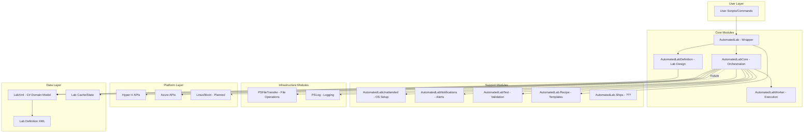
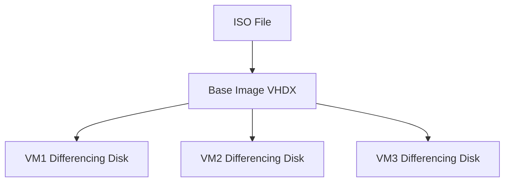
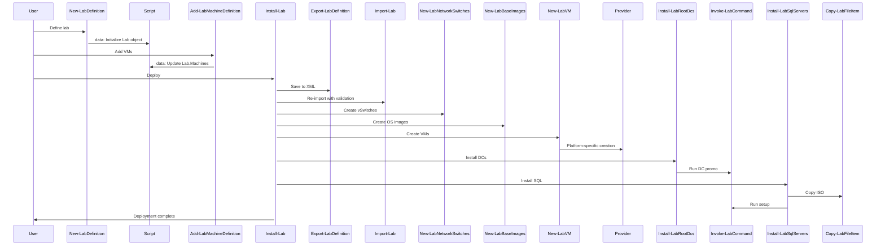
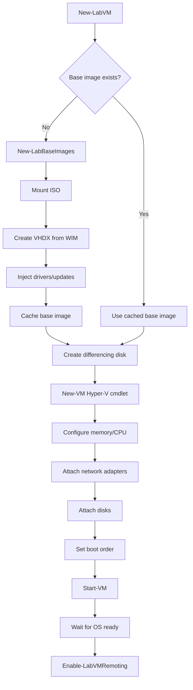
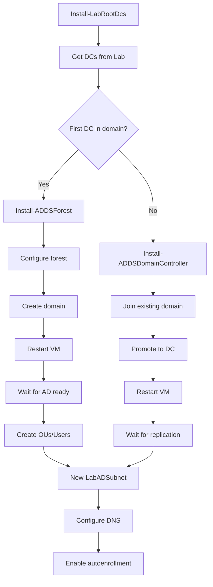
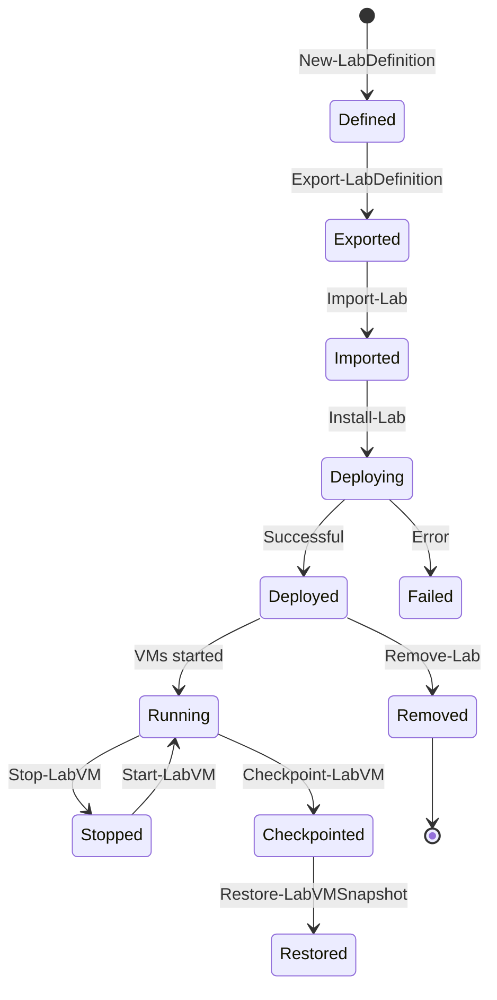

# System Patterns: AutomatedLab Architecture

## High-Level Architecture

AutomatedLab follows a modular, layered architecture:



## Module Responsibilities

### AutomatedLab (Wrapper Module)
**Purpose**: User-facing entry point and convenience layer

**Key Functions**:
- Re-exports functions from core modules
- Provides unified interface
- Module manifest only (no .psm1)

**Location**: `AutomatedLab/`

### AutomatedLabDefinition
**Purpose**: Lab design and definition layer

**Responsibilities**:
- Define lab structure (machines, networks, roles)
- Validate lab definitions
- Export/Import lab configurations
- Network and domain configuration

**Key Concepts**:
- `New-LabDefinition` - Initialize new lab
- `Add-LabMachineDefinition` - Add VM to lab
- `Add-LabVirtualNetworkDefinition` - Define networks
- `Add-LabDomainDefinition` - Define AD domains

**Location**: `AutomatedLabDefinition/`

**Functions**: ~30 cmdlets focused on lab specification

### AutomatedLabCore
**Purpose**: Orchestration and deployment engine

**Responsibilities**:
- Lab deployment coordination
- Role installation management
- VM lifecycle management
- Network setup and configuration
- Integration with Hyper-V/Azure
- Progress tracking and reporting

**Key Concepts**:
- `Install-Lab` - Master orchestration function
- `Get-Lab` - Retrieve current lab state
- `Remove-Lab` - Teardown lab environment
- Role-specific installation functions

**Location**: `AutomatedLabCore/`

**Functions**: 184+ cmdlets organized by category:
- `functions/Core/` - Core lab operations
- `functions/ADDS/` - Active Directory
- `functions/SQL/` - SQL Server
- `functions/Azure/` - Azure integration
- `functions/HyperV/` - Hyper-V operations
- `functions/VirtualMachines/` - VM management
- etc. (25+ subdirectories)

### AutomatedLabWorker
**Purpose**: Low-level execution layer

**Responsibilities**:
- Direct hypervisor interaction
- VM provisioning operations
- Disk management
- Network adapter configuration
- PowerShell remoting setup

**Location**: `AutomatedLabWorker/`

**Pattern**: Internal functions called by AutomatedLabCore

### AutomatedLabUnattended
**Purpose**: Unattended OS installation generation

**Responsibilities**:
- Generate Windows unattend.xml files
- Configure Kickstart files for Linux
- AutoYast configuration
- CloudInit support

**Key Concepts**:
- Automated OS installation without user interaction
- Supports Windows, Linux, various distros

**Location**: `AutomatedLabUnattended/`

### Supporting Modules

**AutomatedLabNotifications**
- Send notifications (email, toast, etc.)
- Integration with notification providers

**AutomatedLabTest**
- Pester-based deployment testing
- Validation of lab state
- Post-deployment verification

**AutomatedLab.Recipe**
- Pre-built lab templates
- Snippet management
- Quick-start scenarios

**PSFileTransfer**
- File transfer operations to/from VMs
- Both SMB and PowerShell remoting methods

**PSLog**
- Structured logging framework
- Progress indication
- Debugging support

## Data Model (LabXml - C# Library)

**Purpose**: Strongly-typed domain model for lab definitions

**Location**: `LabXml/` (.NET project)

**Key Classes**:
```csharp
// Lab hierarchy
Lab
  ├── Machines (LabMachine[])
  ├── VirtualNetworks
  ├── Disks
  ├── Domains
  ├── Azure (AzureSettings)
  └── Stores (ISO/Software paths)

// Machine definition
LabMachine
  ├── Name, FQDN
  ├── Roles (Role[])
  ├── NetworkAdapters
  ├── Disks
  ├── Memory, Processors
  ├── OperatingSystem
  └── HostType (HyperV/Azure/VMWare)

// Enumerations
- VirtualizationEngine (HyperV, Azure, VMWare)
- Roles (RootDC, DC, SQL, Exchange, etc.)
- OperatingSystemType (Windows, Linux)
```

**Benefits**:
- Type safety for lab definitions
- Serialization to/from XML
- Validation logic
- IntelliSense support

## Key Design Patterns

### 1. **Script-to-Module Organization**

**Pattern**: One function per file, organized by category

```
AutomatedLabCore/
├── functions/
│   ├── Core/
│   │   ├── Install-Lab.ps1
│   │   ├── Get-Lab.ps1
│   │   └── Remove-Lab.ps1
│   ├── ADDS/
│   │   ├── Install-LabRootDcs.ps1
│   │   └── Install-LabDcs.ps1
│   └── SQL/
│       └── Install-LabSqlServers.ps1
└── internal/
    ├── functions/  # Private helper functions
    └── scripts/    # Module initialization
```

**Benefits**:
- Easy to locate functions
- Clear separation of concerns
- Modular development

### 2. **Orchestration Pattern**

**Install-Lab** follows a phased deployment pattern:

```powershell
# Phase 1: Infrastructure
Install-Lab -NetworkSwitches
Install-Lab -BaseImages
Install-Lab -VMs

# Phase 2: Foundation Services
Install-Lab -Domains  # DCs first
Install-Lab -Routing
Install-Lab -CA

# Phase 3: Application Services
Install-Lab -SQLServers
Install-Lab -FileServers
Install-Lab -WebServers

# Phase 4: Post-Deployment
Install-Lab -PostInstallations
Install-Lab -PostDeploymentTests
```

**Key Characteristics**:
- Sequential phases with dependencies
- Parallelization within phases
- Checkpointing between phases
- Idempotent where possible

### 3. **Base Images and Differencing Disks**

**Pattern**: Copy-on-Write disk optimization



**Implementation**:
- One base image per OS version
- Cached for reuse across labs
- Differencing disks per VM (small, fast)
- Significant storage savings

### 4. **Script Data Pattern**

**Pattern**: Module-scoped `$Script:data` variable holds lab state

```powershell
# In module scope
$Script:data = $null  # Lab object

# Functions access shared state
function Get-Lab {
    if ($Script:data) {
        $Script:data
    }
}

function Import-Lab {
    $Script:data = [AutomatedLab.Lab]::Import($path)
}
```

**Benefits**:
- Centralized lab state
- No need to pass context between functions
- Singleton pattern for current lab

**Drawbacks**:
- Global state can be fragile
- Difficult to work with multiple labs simultaneously
- Testing challenges

### 5. **Provider Pattern**

**Pattern**: Abstract virtualization engine differences

```powershell
# Common interface
Start-LabVM -ComputerName 'Server1'

# Internally dispatches to provider
switch ($vm.HostType) {
    'HyperV' { Start-LWHypervVM }
    'Azure'  { Start-LWAzureVM }
    'VMWare' { Start-LWVMWareVM }
}
```

**Provider Functions**:
- Prefixed with `LW` (LabWorker)
- Implement platform-specific logic
- Called by orchestration layer

### 6. **Pre/Post Installation Activities**

**Pattern**: Extensibility through custom script blocks

```powershell
Add-LabMachineDefinition -Name Server1 `
    -PreInstallationActivity {
        # Runs before role installation
        # Configure prerequisites
    } `
    -PostInstallationActivity {
        # Runs after role installation
        # Custom configuration
    }
```

**Use Cases**:
- Custom software installation
- Configuration not covered by roles
- Integration with external systems

### 7. **Role-Based Installation**

**Pattern**: Declarative role assignment with automated installation

```powershell
# User declares roles
Add-LabMachineDefinition -Name SQL1 -Roles SQLServer2019

# Framework handles installation
Install-Lab -SQLServers
  └─> Install-LabSqlServers
      └─> Copies ISO, runs setup.exe with parameters
```

**Role Properties**:
- Role name (enum)
- Optional properties (instance name, features, etc.)
- Installation media requirements

### 8. **Configuration Caching**

**Pattern**: Cache expensive operations

```powershell
# Disk speed measurement (one-time)
$Script:fastestDisk = Measure-LabDiskSpeed | 
    Select-Object -First 1

# ISO scanning
$Script:availableOs = Get-LabAvailableOperatingSystem -Path $labSources

# Reuse across lab deployments
```

**Cached Data**:
- Disk performance metrics
- Available operating systems
- Network adapter configurations
- Azure subscription details

## Critical Implementation Paths

### Path 1: Lab Deployment Flow



### Path 2: VM Creation Flow (Hyper-V)



### Path 3: Active Directory Installation



## Component Interactions

### Inter-Module Dependencies

```
AutomatedLab (facade)
    └── Depends on: ALL modules (re-exports)

AutomatedLabCore (orchestrator)
    ├── Depends on: AutomatedLabDefinition (lab structure)
    ├── Depends on: AutomatedLabWorker (execution)
    ├── Depends on: AutomatedLabUnattended (OS setup)
    ├── Depends on: PSFileTransfer (file operations)
    ├── Depends on: PSLog (logging)
    └── Optionally: AutomatedLabNotifications (alerts)

AutomatedLabDefinition
    └── Depends on: LabXml (domain model)

AutomatedLabWorker
    └── Depends on: LabXml, PSFileTransfer

LabXml (C# library)
    └── No PowerShell dependencies
```

### External Dependencies

**Hyper-V Provider**:
- Hyper-V PowerShell module
- Windows Management Framework
- Administrator privileges

**Azure Provider**:
- Az PowerShell modules (Az.Compute, Az.Network, Az.Storage, etc.)
- Azure subscription
- Service principal or interactive auth

**Common**:
- .NET Framework 4.7.1+ (Windows PowerShell)
- .NET Core 2.x+ (PowerShell 6+)
- SysInternals tools (auto-downloaded)

## State Management

### Lab State Storage

**Primary Storage**: XML files in `$env:ProgramData\AutomatedLab\Labs\<LabName>\`

```
Labs/
└── MyLab/
    ├── Lab.xml                    # Complete lab definition
    ├── Disks/                     # Disk definitions
    ├── Machines/                  # Machine configs
    ├── Unattended/                # OS install files
    └── PostInstallationActivities/
```

**In-Memory State**: `$Script:data` variable (type: `[AutomatedLab.Lab]`)

**Cache**: Performance data, ISO scans

### State Transitions



## Error Handling Patterns

### Try-Catch Blocks
Most functions use try-catch for error handling:

```powershell
try {
    # Main logic
    $result = Invoke-SomeOperation
}
catch {
    Write-Error "Operation failed: $_"
    # Cleanup if needed
}
```

### Validation
Pre-flight validation before expensive operations:

```powershell
# In Import-Lab
if (-not (Test-Path $LabXmlPath)) {
    throw "Lab definition not found"
}

# Validate virtualization engine available
if ($engine -eq 'HyperV' -and -not (Get-Module Hyper-V)) {
    throw "Hyper-V module required"
}
```

### Progress and Logging

```powershell
Write-ScreenInfo -Message 'Creating VMs' -TaskStart
try {
    # Work
    Write-ScreenInfo -Message 'Done' -TaskEnd
}
catch {
    Write-ScreenInfo -Message 'Failed' -Type Error
}
```

## Performance Optimizations

### 1. Parallelization
- Multiple VMs created in parallel (Hyper-V)
- Parallel role installations where possible
- Background jobs for long-running operations

### 2. Base Images
- One base image per OS version
- Differencing disks per VM
- Massive storage and time savings

### 3. Caching
- Disk performance measured once
- ISO contents scanned once
- Results cached for reuse

### 4. Lazy Loading
- Modules loaded on-demand
- Azure modules only when needed
- Minimal startup overhead

## Testing Strategy

### Test Types

**Integration Tests**: Full lab deployments in `LabSources/SampleScripts/`

**Unit Tests**: Pester tests in `AutomatedLabTest/tests/`

**Post-Deployment Tests**: Automated validation via `Install-LabPester`

### Test Coverage
- General tests (PSScriptAnalyzer compliance)
- Role-specific tests (ADFS, SQL, etc.)
- Platform tests (Azure, Hyper-V)

## Known Technical Debt

### PSScriptAnalyzer Exclusions

Many rules excluded in `scriptanalyzer/AutomatedLabRules.psd1`:
- `PSAvoidGlobalVars` - Heavy use of `$Script:data`
- `PSAvoidUsingInvokeExpression` - Some dynamic scenarios
- `PSAvoidUsingPlainTextForPassword` - Lab credentials
- `PSUseShouldProcessForStateChangingFunctions` - Missing on many functions
- `PSAvoidUsingEmptyCatchBlock` - Some error suppression

### Code Style Inconsistencies
- Mixed brace styles (some K&R, some Allman)
- Inconsistent spacing and indentation
- Variable naming conventions vary
- Comment-based help incomplete in places

### Architecture Concerns
- Heavy reliance on module-scoped state (`$Script:data`)
- Tight coupling between Core and Worker in places
- Some functions very large (Install-Lab is 1000+ lines)
- Limited abstraction layers in some areas

**Next Steps**: The tech context document will detail the specific technologies and tools used.
